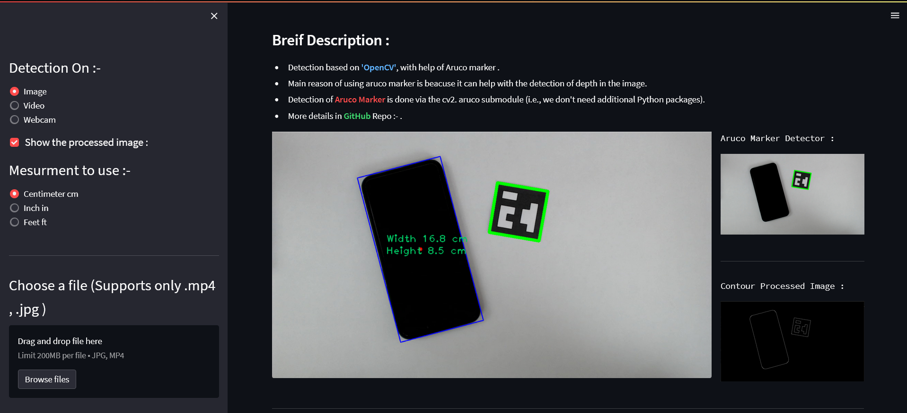

# **Size Estimation with OpenCV and Aruco Marker**
#### Made by :- Srivatsa Gorti

**Aim** :- An end-to-end project of estimating size of different objects in an image , video or webcam . It uses Aruco Marker to identify the depth in the image and OpenCV to process the image and identify objects and displays the size in Cm , In , Ft.


## Dash-Board Example




## Requirements

Install all the needed pyhton Library using requirements.txt 

```
  pip install requirements.txt
```
opencv-contrib-python\
numpy\
Pillow\
imutils\
streamlit
    
## Deployment


- Open Git Bash.

- Change the current working directory to the location where you want the cloned directory.
- Copy the URL from the repository.

  
- Type `git clone` , and then paste the copied URL of the repository
- Clone the repository :

```cmd
   $ git clone https://github.com/srivatsacool/Size-Estimation-with-CV2-and-Aruco
```

To deploy this project run  :

```cmd
   streamlit run '.\Size Estimation with OpenCV and Aruco Marker.py'
```

