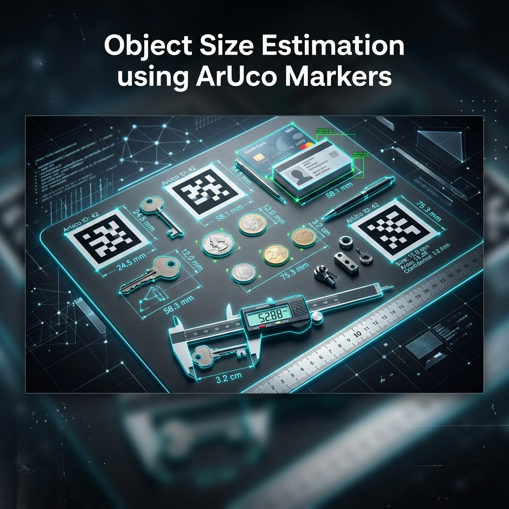

# Object Size Estimation with OpenCV & ArUco Markers

<p align="center">
  
</p>

## Overview

An end-to-end computer vision project that **estimates the real-world dimensions of objects** from images, video, or a live webcam feed. By using an **ArUco marker** as a known-size reference, the system calculates depth and scale, then measures objects in **centimeters, inches, and feet** using OpenCV contour detection.

---

## Live Demo

🔗 **Try it out:** [Streamlit App](https://srivatsacool-size-estimation-with-cv2-and-aruco-app-k04nek.streamlit.app/)

---

## Key Features

- **Multi-input support** — Works with static images, video files, and live webcam
- **ArUco-based calibration** — Uses marker as a reference for accurate real-world measurements
- **Multiple units** — Displays measurements in cm, inches, and feet
- **OpenCV-powered** — Contour detection and image processing pipeline
- **Interactive UI** — Streamlit dashboard for easy interaction

---

## Technology Stack

| Technology | Purpose |
|---|---|
| Python 3 | Core language |
| OpenCV (contrib) | Image processing & ArUco detection |
| NumPy | Numerical computations |
| Pillow | Image handling |
| imutils | Image utility functions |
| Streamlit | Web application interface |

---

## How It Works

```text
Input (Image / Video / Webcam)
        ↓
ArUco Marker Detection
        ↓
Scale Calibration (px → real units)
        ↓
Object Contour Detection
        ↓
Dimension Calculation
        ↓
Annotated Output with Measurements
```

---

## Installation & Setup

```bash
git clone https://github.com/srivatsacool/Size-Estimation-with-CV2-and-Aruco
cd Size-Estimation-with-CV2-and-Aruco
pip install -r requirements.txt
streamlit run app.py
```

---

## Author

**Srivatsa Gorti**

---
